# trajectory_tracking
This is a ROS application to test trajectory tracking algorithms for mobile robots using Gazebo as simulator.
The robot that has been used for this project is [Turtlebot 2][1] which is an affordable mobile robot widely used for research.
People who are interested can test these algorithms in a real robot.

The algorithms that have been used so far are:
* Numerical method controller using Euler's approximation.
* PID controller

These algorithms have been tested, and are properly working for the following trajectories:
* Linear Trajectory
* Circular Trajectory
* Squared Trajectory

### Trajectories
Three trajectories have been used to test each controller.

#### Linear Trajectory
This trajectory has been defined by the following parametric equations:

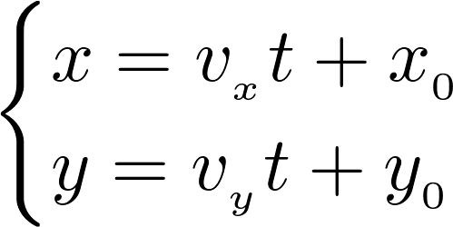

where (x, y) represent the position of the robot at time t, v_x and v_y is the linear velocities for the x and y axes,
and x_0 and y_0 are the initial values for x and y positions.

#### Circular Trajectory
This trajectory has been defined by the following parametric equations:

where (x, y) represent the position of the robot at time t, v is the linear velocity of the robot,
and x_0 and y_0 are the initial values for x and y positions, R represents the radius of the circle, and T the time that
the robot takes in order to complete the circular trajectory.

#### Squared Trajectory
This trajectory has been defined by the following equations:

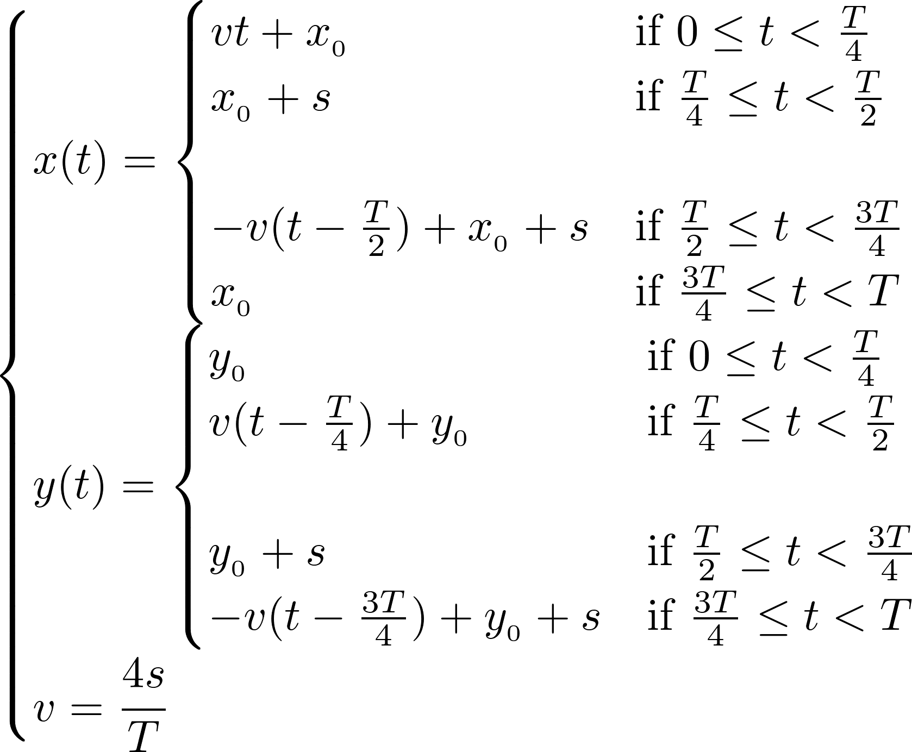

where (x, y) represent the position of the robot at time t, v is the linear velocity of the robot,
and x_0 and y_0 are the initial values for x and y positions, s represents the side of the square, and T the time that
the robot takes in order to complete the circular trajectory.

### Experiments and Results
The performance of both controllers was excellent, and this is shown in the obtained results.
For each experiment a video and its corresponding results are shown. In order to run the
simulation as fast as possible for Gazebo, the parameter **_real_time_update_rate_** has been
set to 0.00000 in **_worlds/room.world_**.

#### Euler Method Controller

##### Linear Trajectory

**Video:** [Euler: Linear Trajectory Test][2]

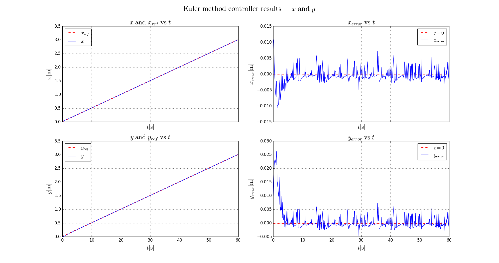
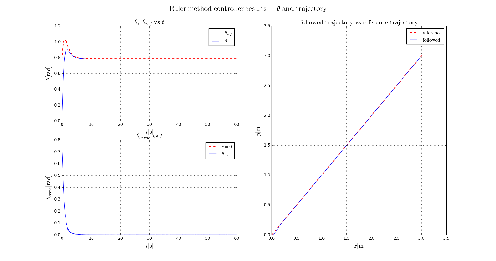

##### Circular Trajectory

**Video:** [Euler: Circular Trajectory Test][3]

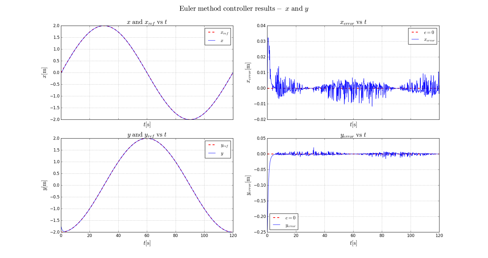
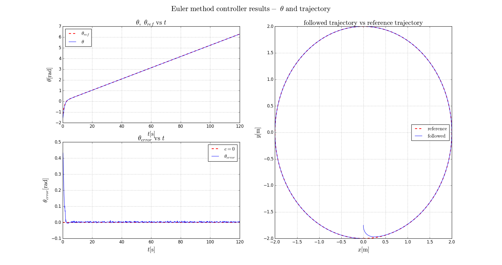

##### Squared Trajectory

**Video:** [Euler: Squared Trajectory Test][4]

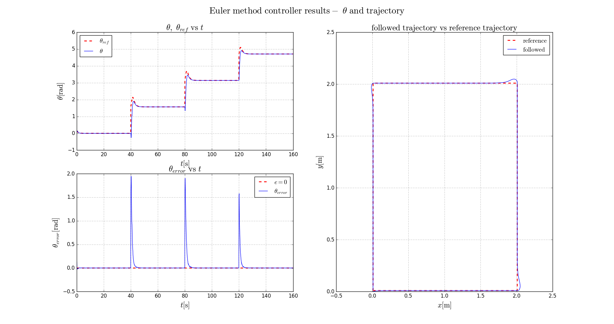

#### PID Controller

##### Linear Trajectory

**Video:** [PID: Linear Trajectory Test][5]

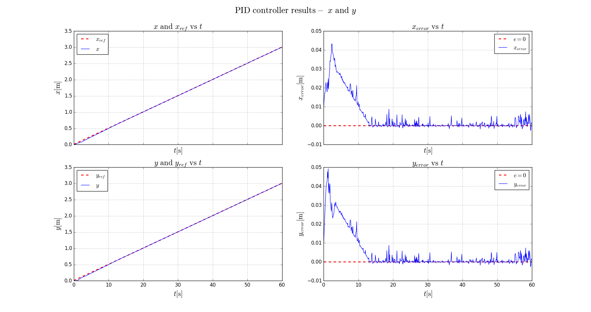

##### Circular Trajectory

**Video:** [PID: Circular Trajectory Test][6]

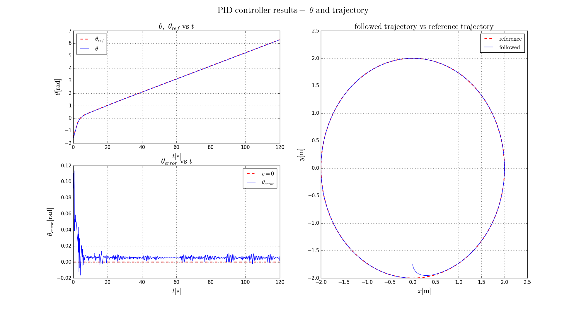

##### Squared Trajectory

**Video:** [PID: Squared Trajectory Test][7]

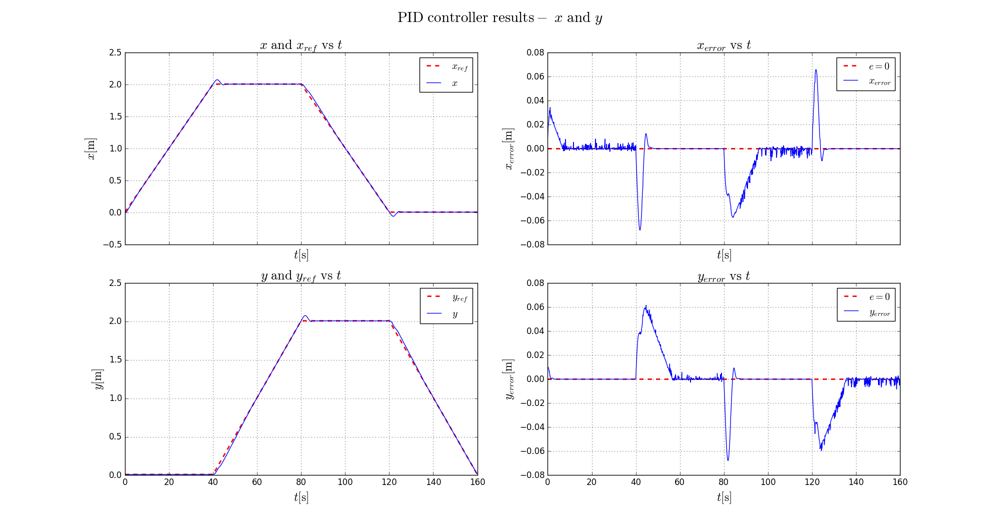
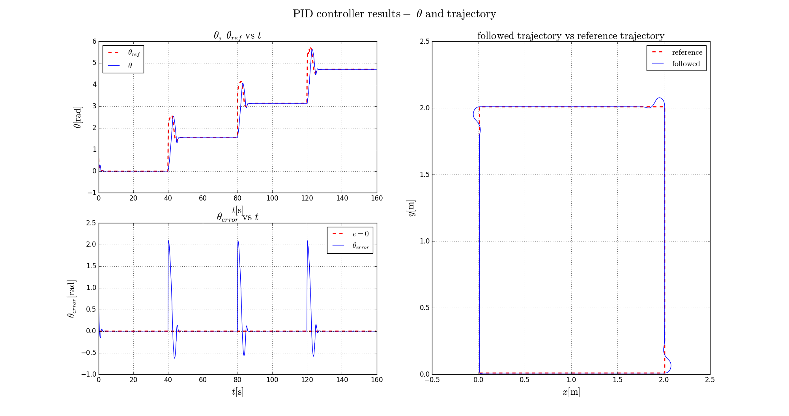

[1]: http://www.turtlebot.com/
[2]: https://www.google.com/
[3]: https://www.google.com/
[4]: https://www.google.com/
[5]: https://www.google.com/
[6]: https://www.google.com/
[7]: https://www.google.com/
